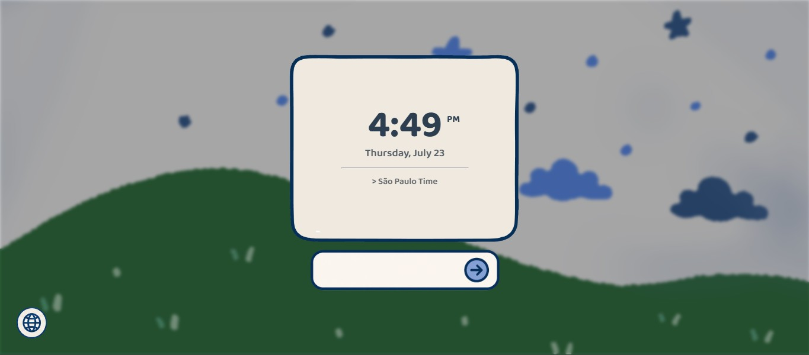
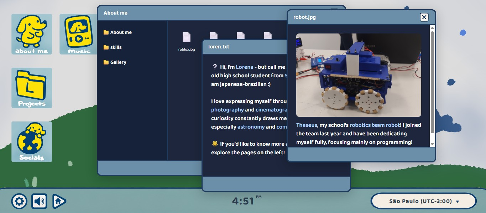
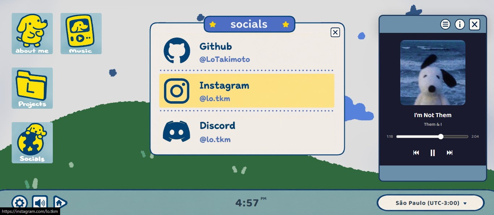

> This project used AI for improvement suggestions, debugging help, and quick fixes along the way.
---

## ABOUT THE PROJECT

Honestly, this project means a lot more to me than I expected.

I grew up working with robotics and competitive programming. These activities involved clear right and wrong answers, judges, medals, and rankings. This was the first time I created something without a set guideline. There was no one telling me what "right" looked like. It was just me deciding how I wanted it to feel and figuring out how to make it happen.

I didn't want a page that just lists what I've done. I wanted something that felt like me. So, I built a little desktop. You click an icon and a window opens. You can drag it around. You can open folders inside folders, find a music player, and hear little sounds when you hover over things :)

This is the first thing I've built that I would call mine, not just something I finished.

---

## HOW TO RUN IT

Live version: [loren.devlucas.page](https://loren.devlucas.page/)

Or run it locally:
 1. Clone or download this repository
 2. Open `index.html` in your browser

(Best experienced on desktop, since it relies on dragging windows around with a mouse. Tested on Chrome.)

---

## DESIGN

When I started this project, most of the visual elements were hand drawn. Icons, buttons, and even a few windows existed as PGN illustrations I created myself. 

As the project grew, I gradually replaced those assets with pure CSS. This change improved the website’s responsiveness and made the codebase cleaner. I watched several CSS tutorials on my own to learn how to recreate things I used to draw by hand. It turned out to be much easier than I expected.

Today, the website blends illustration and code.

Font: [Baloo 2](https://font.download/font/baloo-2-2) via [Google Fonts](https://fonts.google.com/specimen/Baloo+2)

---

## Built using:

### Code:
 - HTML
 - CSS
 - JAVASCRIPT

### Design:
 - SKETCHBOOK

### Websites/References:
 - [W3Schools](https://www.w3schools.com/)
 - [FreeCodeCamp](https://www.freecodecamp.org/)
 - [Pixabay](https://pixabay.com/) - Sound Effects
 - [Pinterest](https://pinterest.com/) - Design refs!

 ---

## NOTE

This is a personal project I made to represent myself! feel free to look around and get inspired, but please don't copy the design, assets, or content as your own. :)

---

* Special thanks to [Lucas Honda](https://github.com/lucasht22) for motivating me to develop my website! 

