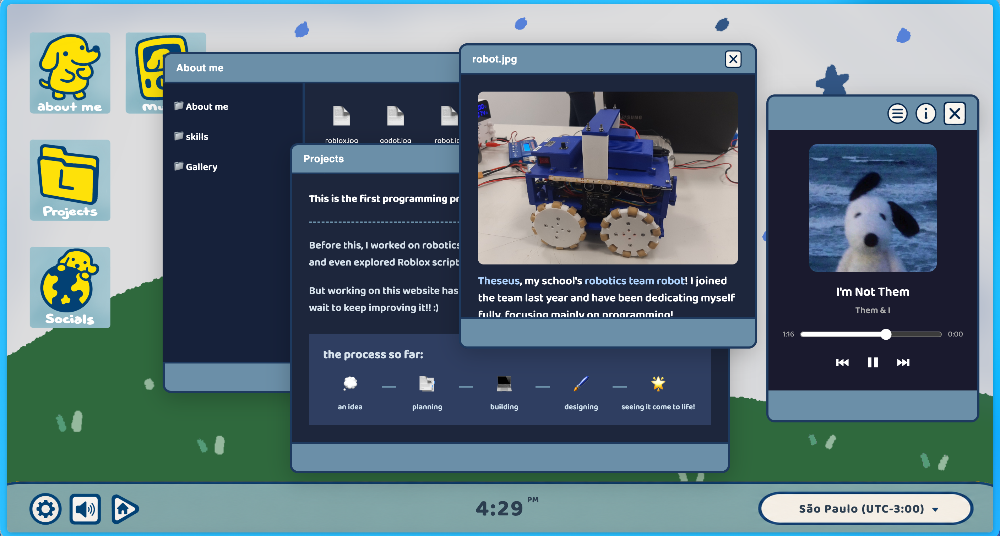

> NOTE: This project used AI for improvement suggestions and quick fixes!
---

---

# My Personal Website yippiee

This is the first website I've ever built, and honestly, It's the project that made me truly fall in love with web development!!

Before this, my experience was mostly with robotics, C++, Python and just a liiitle but of HTML.

I learned a lot, but never really invested myself into creating something that actually felt mine.

Seeing my ideas come to life feels completely different :)

---

## ABOUT THE PROJECT

Instead of a traditional portfolio, I wanted to build something that represents who I am.
The website is designed as a cartoon inspired computer workspace, where every app opens a different part of my world. 

Rather than scrolling through a boring page, visitors can explore It like they're using my own desktop.

---

## DESIGN

When I started this project, most of the visual elements were hand-drawn. Icons, buttons.. even a few windows! Almost everything existed first as PNG illustrations.

As the project grew, I slowly began replacing those assets with pure CSS -> which allowed the website to have better responsiveness, and much cleaner codebase.

Today, the website is a mix of illustration and code!

---

## Built using:

### Code:
 - HTML
 - CSS
 - JAVASCRIPT

### Design:
 - SKETCHBOOK

### Websites/References:
 - [W3Schools](https://www.w3schools.com/)
 - [FreeCodeCamp](https://www.freecodecamp.org/)
 - [Pixabay](https://pixabay.com/) - Sound Effects
 - [Pinterest](https://pinterest.com/) - Design refs!

 ---

* Special thanks to [Lucas Honda](https://github.com/lucasht22) for motivating me to develop my website! 

